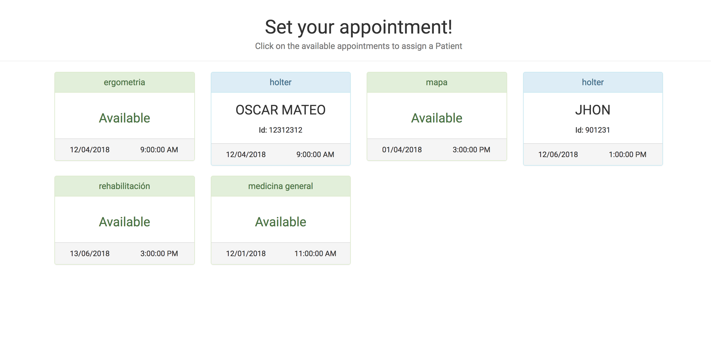

### Appointment Manager

This is an Appointment manager application where you can assign patients to each appointments, you can search for the patients by their names or their ids.

This application was built using `React.JS` and `Redux`.

I also implemented other external libraries like `React-redux`, to wrap the components and send the redux data via Props, so the Components kept much smaller and stateless. `react-bootstrap` for the styling, `Axios` for the remote requests and `thunk` to manage the middlewares in order to get the axios response.

For the search engine it was user `react-bootstrap-typahead`.
